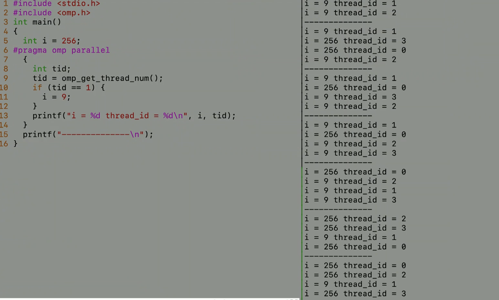
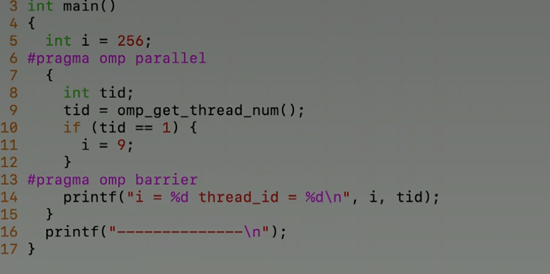

**Why above code has non-deterministic output?**

There are cases when the thread 1 has not finish the update but other threads reach the print function. It's called "race condition".

**How to solve this problem?**

Need to syncronize before print function. 



Other example of race condition:

```c
#include <omp.h>
int main() {
  int i = 0; // shared variable
  {
    int x; // a local variable for each thread
    x = omp_get_tread_num();
    i++;
    printf("i = %d thread_id %d/n", i, x);
  }
}
```

In the above code, the variable `i` is not atomic because it is being incremented inside a parallel region, without any synchronization mechanism to pretect it from race conditions. Each thread executing the parallel region will have its own private copy of the variable `x` but they all access the shared variable `i`.