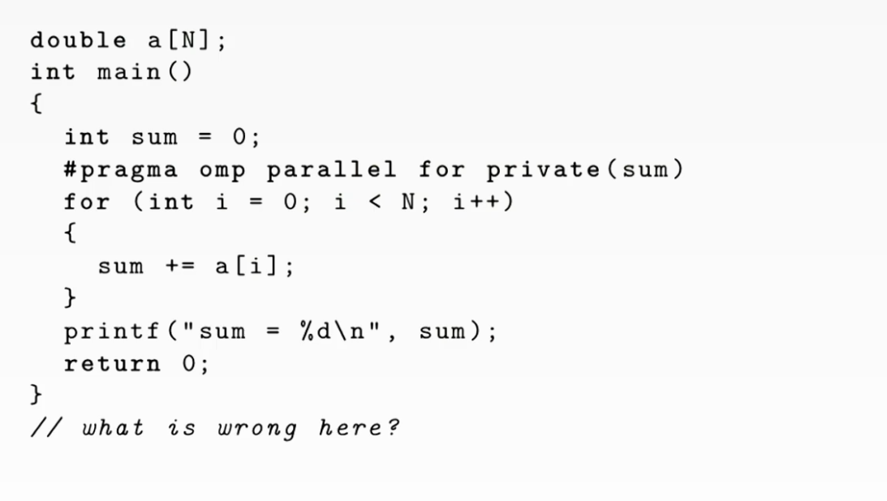

# Barriers

```c++
#pragma omp barrier
```

Explicit Barrier is an expensive synchronization.

Every #pragma omp for will have a implicit barrier after the for loop, unless it is clearly stated, e.g. #pragma omp for **nowait**


# Data Sharing

**What is shared and not shared?**

Everything before #pragma omp parallel is shared. Everything within the parallel clause will have a private copy for each thread.



Since it clearly states that "private(sum)", each thread should have a private copy of sum. The sum outside the parallel clause is actually zero, because each thread is updating its private copy. Thus, the print function outside the clause will print zero.

**Different Types of Sharing**

Private, first private and shared.

# Tasks

If for computation is not regular (i.e. we desire thread 1 runs function1, thread2 runs function 2... ), we need to define tasks within parallel clause. 

```c++
#pragma omp parallel
{
 #pragma omp single
 {
   #pragma omp task
   func1();
   #pragma omp task
   func2();
   #pragma omp taskwait
 }
}
```


# Parallely Traverse Nodes

# Task Dependences

Read after writing. RAW

Write after reading. WAR

Write after writing. WAW

RAR is not a dependency.


# SOCKET


