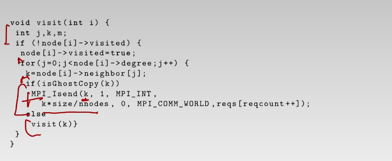
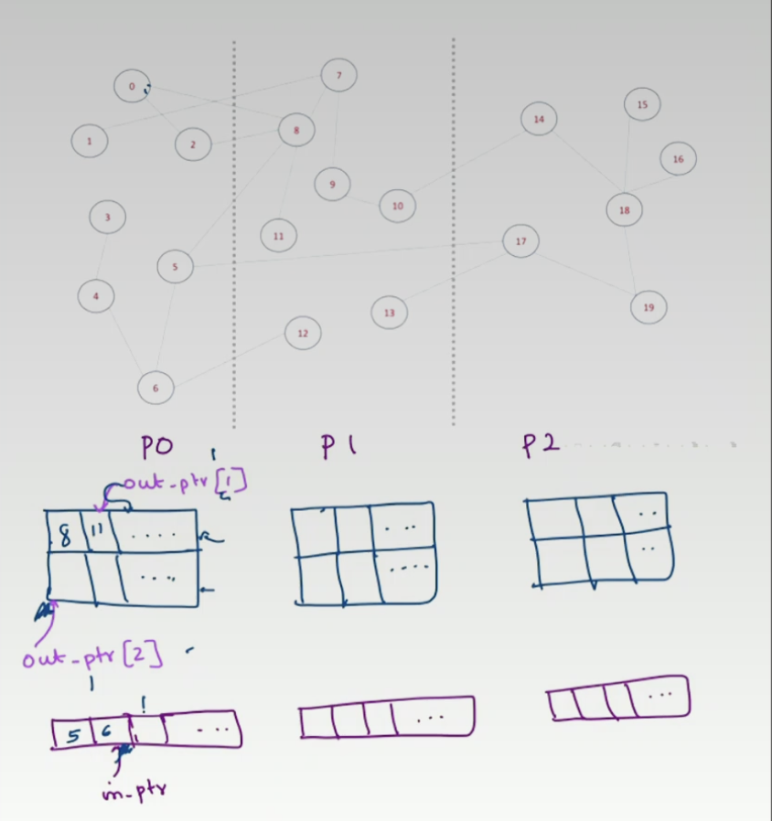

# First Thing to Know

**What is the difference between OpenMP and MPI?**

Both of them are parallel programming interfaces allow programmers to write parallel code for multi-core processors or distributed systems. The main difference is that OpenMP is based on shared memory architecture, where all threads have access to a comon memory. MPI is designed for distributed memory systems, where each node has its own memory and nodes communicate with each other through messages. Node refers to a computing unit in a larger computing system.

Generally, OpenMP is designed for shared memory parallel programming on a single computer. MPI is designed for distributed memory systems like clusters of computers connected by a network.

**What is communicating?**

In MPI, communications are between processes. Typically, they are on different nodes, but they could appear in the same node.

# Message Passing

## Quick review of process:

A process is an **instance** of a computer program that is being executed. A process has its own address space, which contains the program code, data, and stack space for the running program. The variable of processes are not shared by default.

## MPI

**Communicator**

Communicator is an object that define a group of processes that can communicate with each other. 

**Rank**

The unique integer that identify the processes within a communicator. The rank is determined by the order of process start.

**Size**

The total number of processes in a communicator

**Mechanism of Communciating**

In MPI, the machanism of process communicating is message passing. Processes communicate with each other by sending and receiving data. There are many functions communications like: MPI_Send and MPI_Recv. 

### Functions for Communicating

**MPI_Send(sendbuf, count, type, dest, tag, comm)**

`MPI_Send` is a blocking function that sends a message from one process to another process in an MPI communicator. The function has the following parameters:

- `sendbuf`: A pointer to the send buffer that contains the data being sent. The send buffer must be allocated and initialized by the sending process.
- `count`: The number of elements in the send buffer.
- `type`: The data type of the elements in the send buffer.
- `dest`: The rank of the destination process that will receive the message.
- `tag`: An integer tag that identifies the message. The tag is a user-defined value that distinguishes the message from other messages that may be sent between the same two processes.
- `comm`: The communicator that the sending and receiving processes belong to.
- **MPI_Recv(recvbuf, count, type, source, tag, comm)**

`MPI_Recv` is a blocking function that receives a message from another process in an MPI communicator. The function has the following parameters:

- `recvbuf`: A pointer to the receive buffer that will store the received data. The receive buffer must be allocated and initialized by the receiving process.
- `count`: The maximum number of elements that can be received in the receive buffer.
- `type`: The data type of the elements in the receive buffer.
- `source`: The rank of the source process that sent the message. If `MPI_ANY_SOURCE` is used, the function will receive a message from any source.
- `tag`: An integer tag that identifies the message. If `MPI_ANY_TAG` is used, the function will receive a message with any tag.
- `comm`: The communicator that the sending and receiving processes belong to.

If the `MPI_Send` function and the `MPI_Recv` function do not match, the program can exhibit unpredictable behavior, including deadlock, data corruption, or program crashes. It's important to ensure that every send and receive function has a matched counter part. And also the amount and type of data should be matched.

## Buffer

A buffer is needed when using MPI communication functions because data being sent or received must be stored somewhere while it is in transit between processes. Data go through `memory of sender processor` -> `out buffer` -> `in buffer` -> `memory of receive processor`.

Using a buffer ensures that the data being sent or received is not lost or corrupted during transmission.

Besides arrays, the buffer can be any contiguous block of memory that can hold the data being sent or received.

### What is input buffer and output buffer for communicator?

The "in-buffer" refers to the buffer that is used to hold the data being received by the receiving process. The "out-buffer" refers to the buffer that is used to hold the data being sent by the sending process.

### Why bother copy data to another block of memory?

## Example: Parallel Sort

### The Navie Way

Let communicator size equal 2. When rank = 0, sent half of the array to process 1. Sort the remaining half of the array. When rank = 1, receive half of the array from process 0. Sort the received array. Then send the sorted array to the process 0. (This MPI_Send should also be matched in process 0)

## Blocking and Non-blocking Communication

**Blocking communication** refers to a communication pattern where the sender and receiver processes are both synchronized during the message transfer. In this case, the sender process waits until the data is sent and receiver process waits until the data is received.

For example, when a process calls MPI_Send(), the process is blocked, which means it cannot continue to execute subsequent lines of the code. After the data has been successfully bufferred by the MPI implementation (copied to another block of memory) or the data has been received by the target process. In some MPI implementations, the sender process may be blocked until the receiver process actually calls MPI_Recv() and receives the message.

**non-blocking communication** allows processes to continue the following execution without waiting for the message transfer to complete. This type of communication is realized using MPI_Isend(), MPI_Irecv() and MPI_Wait(). After calling send and receive, the process continues. Programmer could use MPI_Wait() or MPI_Test() to check if the communication is done.

# Data Distribution

What are the vertices? Are they some computing units inside processes?

What does the connection of two vertices represent? Does it mean two computing units could sent and receive information from each other?

How does a process know it has some vertices or not?

## Bug of the Code

Too much information is sent to a single process, which will crush the system.

Use a two dimensional buffer to temporally hold the messages.

What should be the dimension of the buffer?

The number of the rows is the number of the processes other than the current process. The nubmer of columns is the max number of vertices a process have.

What is in buffer?

Then length of in-buffer is max number of vertices * number of processes.
