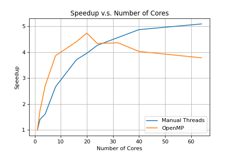

# Question 1

**Briefly comment about how changing the data size affects the performance of the parallel threaded version with four threads, and include the output of the benchmarking program for data size 2048 in your report.**

As the data size increases, the speedup of parallel threaded version with four threads also increases.


Output of benchmarking program for data size 2048

```html
Generating a 2048x2048 mandelbrot with core counts: [1, 2, 4, 8, 16, 20, 24, 32, 40, 64]
The serial version ran for 2.148650527 s.

The parallel version, with 1 core(s), ran for 2.15478676558 s, a speedup of 0.997x.
The parallel version, with 2 core(s), ran for 1.53119754791 s, a speedup of 1.403x.
The parallel version, with 4 core(s), ran for 1.33198928833 s, a speedup of 1.613x.
The parallel version, with 8 core(s), ran for 0.80606675148 s, a speedup of 2.666x.
The parallel version, with 16 core(s), ran for 0.579539477825 s, a speedup of 3.708x.
The parallel version, with 20 core(s), ran for 0.542703747749 s, a speedup of 3.959x.
The parallel version, with 24 core(s), ran for 0.503989994526 s, a speedup of 4.263x.
The parallel version, with 32 core(s), ran for 0.470459461212 s, a speedup of 4.567x.
The parallel version, with 40 core(s), ran for 0.441278219223 s, a speedup of 4.869x.
The parallel version, with 64 core(s), ran for 0.422191262245 s, a speedup of 5.089x.

The OpenMP version, with 1 core(s), ran for 2.17638325691 s, a speedup of 0.987x.
The OpenMP version, with 2 core(s), ran for 1.2375395298 s, a speedup of 1.736x.
The OpenMP version, with 4 core(s), ran for 0.794950246811 s, a speedup of 2.703x.
The OpenMP version, with 8 core(s), ran for 0.556011497974 s, a speedup of 3.864x.
The OpenMP version, with 16 core(s), ran for 0.48793900013 s, a speedup of 4.404x.
The OpenMP version, with 20 core(s), ran for 0.45367372036 s, a speedup of 4.736x.
The OpenMP version, with 24 core(s), ran for 0.49552500248 s, a speedup of 4.336x.
The OpenMP version, with 32 core(s), ran for 0.492665529251 s, a speedup of 4.361x.
The OpenMP version, with 40 core(s), ran for 0.533421754837 s, a speedup of 4.028x.
The OpenMP version, with 64 core(s), ran for 0.568164944649 s, a speedup of 3.782x.
```


# Question 2

**For data size 2048... Plot Speedup vs. Number of Cores using the results of the benchmark program. Be sure to specify which is OpenMP and the manually threaded.**



The blue curve is manual version. The yellow one is OpenMP version.


# Question 3

**For data size 2048... How did the performance of the parallel version with multiple threads compare to serial version? Briefly explain your results.**

We could see that when we using one core, both parallel method performed slightly worse than the serial version. It's because there is usually an overhead with creating and synchronizing threads. If we only use one core, there is no benefit of parallelism. However, it takes extra time for the thread operations.

As we increase the number of cores, both parallel methods uniformly perform much better than serial version. The speeds up increase faster for OpenMP version than Manual version. However, the performance start decreasing after it reaches 20 cores, if using OpenMP. The reason might be followings: for a program there is an upper bound for speeding up using parallelism. OpenMP reaches that upper bound faster than Manual Version. Then, after that, considering the consumption of thread operations, increasing number of threads will decrease the performance.