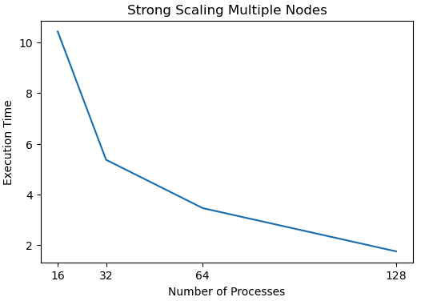

# Question 1

Strong scaling reduces the execution time proportionally to the number of processes. This effect is obvious when the number of processes is small. As the number of processes increases, this benefit diminishes gradually.

# Question 2

Weak scaling significantly increases the execution time when the number of processes is small. This effect also drops drastically as the number of processes increases.

# Question 3

The results are similar to strong scaling with a single node. However, multiple nodes does not reduce the effeiciency obviously.

# Question 4

First, use blocking MPI_Send and MPI_Rcvd could potentially cause deadlocks. Just like what professor exactly mentioned on the lecture 12 page 26. The flow of message exchanging forms a circle and each process is waiting the one ahead to finish. For programmers, we could manually design the order of message exchanging to avoid deadlock. For example, pair the different processes at each time. After they finish one in iteration, then change to another pair. However, that would be mind twisting and also less efficient.

Regard efficiency, the main difference of non-blocking request is that it allows computation and communication happen at the same time. `MPI_Waitall` actually happens after the computation and communication. Even though it's necessary, it non-blocking is still more efficient because it wait does not prohibit performing computation and information exchange run together.