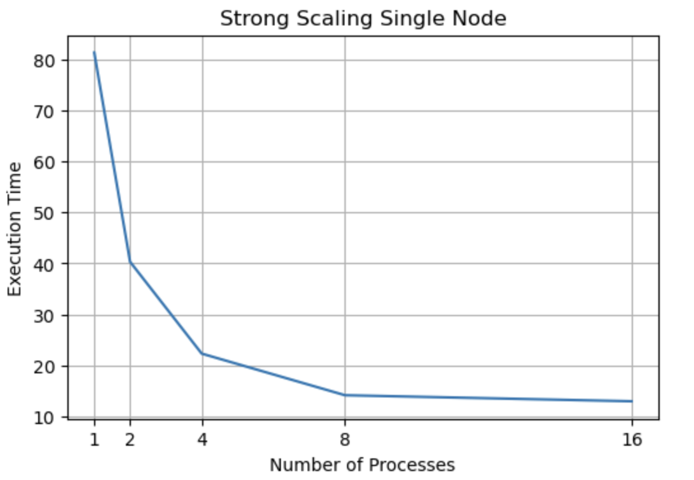

# Question 1

The following is the strong scaling of single node plot. Generally, the execution time deceases as the number of processes increase. However, the extra benefits gain from increasing processes are diminished gradually.

# Question 2

The following is the weak scaling. Keep the workload for each processes fixed, as we increase the number of processes, the execution time will also increase. One of the reasons is the communication time increases among different processes.

If the system scales perfectly, it should be able to solve a proportionally larger problem in the same amount of time for each process. However, the communication consumption might be linear with the number of processes. Thus, the ideal line should be a straight line with a constant slop. We could we that our result is close the the idea one.

# Question 3

The results of strong scaling of multiple nodes are similar to the first question. Specifically, the time consumptions are slightly more than the strong scaling on a single node. This might due to the extra work of communication among nodes.

